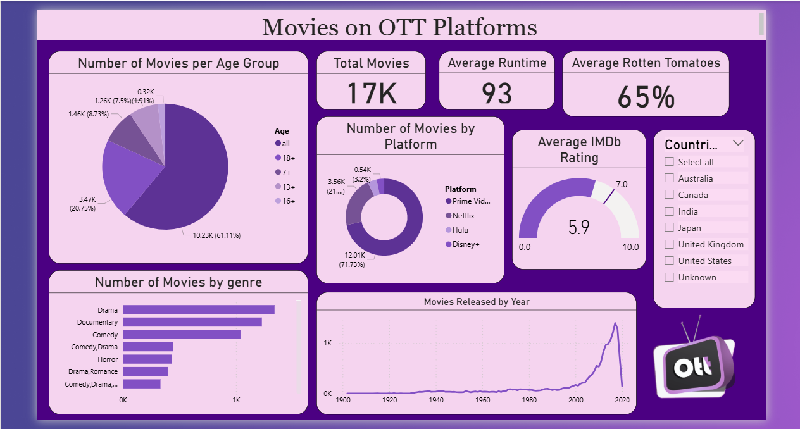

  

<h1 align="center">🎬 Movies on OTT Platforms Dashboard</h1>

<b>Power BI Data Visualization Project</b> 
Beginner-Friendly Dashboard for OTT Movie Analytics

---

# 📌 Description

This project presents a **Power BI dashboard** that visualizes movies available across major OTT platforms. It provides interactive insights into genre distribution, movie ratings, age certifications, platform-wise availability, release trends, and production countries. The dashboard is designed to help users explore movie data through simple and effective visualizations.

---

# 🎯 Objectives

- Visualize the distribution of movies by genre.
- Compare IMDb and Rotten Tomatoes ratings.
- Analyze movie availability across different OTT platforms.
- Explore movie distribution based on age certification.
- Identify trends in movie releases and production countries.

---

# 🛠️ Tools Used

- Excel
- Microsoft Power BI
- Power Query
- CSV Dataset

---

# 📂 Dataset Source

**Movies on OTT Platforms**

🔗 https://www.kaggle.com/datasets/javagarm/movies-on-ott-platforms

---

# 📊 Dashboard Overview

The dashboard highlights:

- Number of movies by genre
- Number of movies by age certification
- Comparison of IMDb and Rotten Tomatoes ratings
- Movie distribution across OTT platforms
- Year-wise movie release trend
- Country-wise movie filtering and analysis

---

# 📈 Dashboard Insights

### 🎥 OTT Platform Distribution
- Compares the number of movies available on Prime Video, Netflix, Hulu, and Disney+.
- Identifies the platform with the largest movie collection.
- Shows the percentage distribution of movies across platforms.
- Helps understand content availability.
- Provides an overview of platform-wise movie libraries.

---

### 🎭 Genre Analysis
- Displays the most popular movie genres.
- Compares movie counts across different genres.
- Highlights dominant genres in the dataset.
- Shows audience content preferences.
- Helps understand genre diversity.

---

### ⭐ Ratings & Runtime Analysis
- Displays the average IMDb rating.
- Shows the average Rotten Tomatoes score.
- Calculates the average movie runtime.
- Summarizes movie quality using KPI cards.
- Enables quick comparison of rating metrics.

---

### 👨‍👩‍👧 Age Certification Analysis
- Visualizes movies across different age groups (All, 7+, 13+, 16+, and 18+).
- Identifies the most common certification category.
- Helps understand audience targeting.
- Compares family-friendly and adult content.
- Supports content classification analysis.

---

### 📅 Movie Release Trend
- Shows the number of movies released over the years.
- Highlights growth in movie production.
- Identifies peak release periods.
- Helps analyze historical movie trends.
- Enables year-wise comparison of releases.

---

# 🎛️ Interactive Features

- Country Filter
- Interactive Charts
- Dynamic KPI Cards
- Cross-filtering between visuals
- Beginner-friendly dashboard layout

---

# 📚 Skills Demonstrated

- Data Cleaning with Power Query
- Data Modeling
- DAX Measures
- Interactive Dashboard Development
- KPI Design
- Data Visualization

---

# 📸 Dashboard Preview

---

# 🚀 Future Enhancements

- Add TV Shows analysis
- Include language-wise analysis
- Create OTT platform comparison dashboard
- Add runtime distribution analysis
- Build recommendation-based visualizations

---

# 👩‍💻 Done By

**Pravalika Ravalkol**
